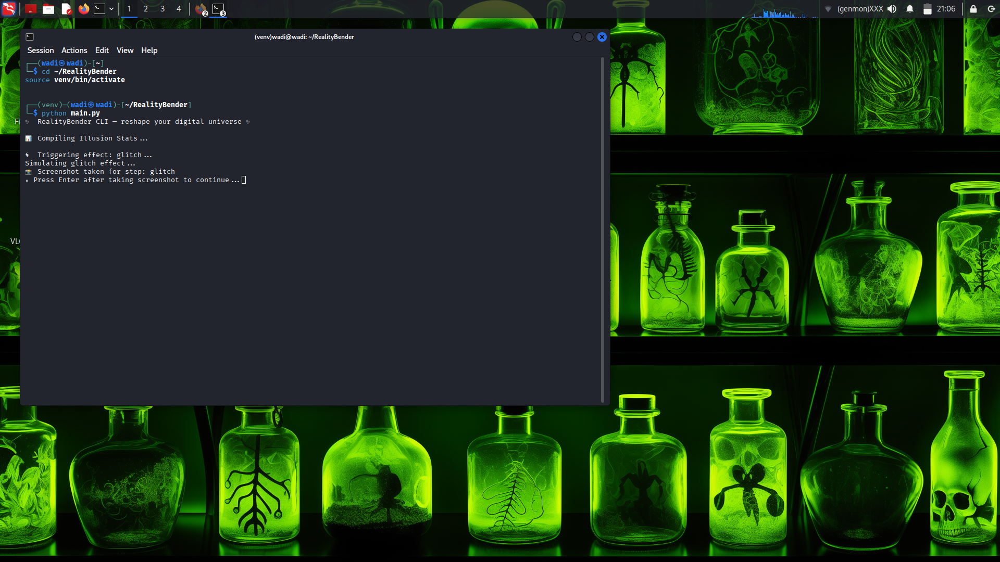
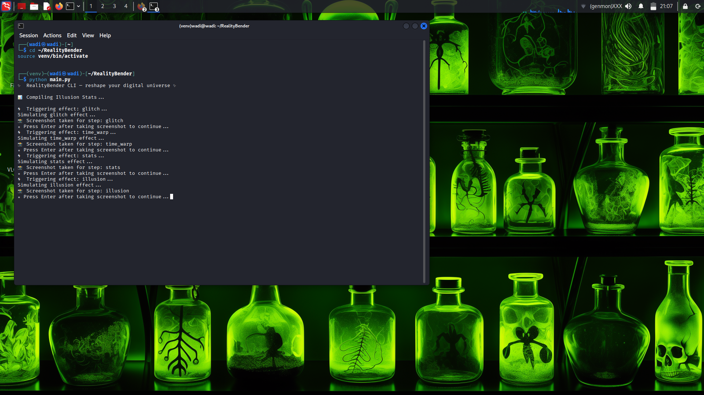
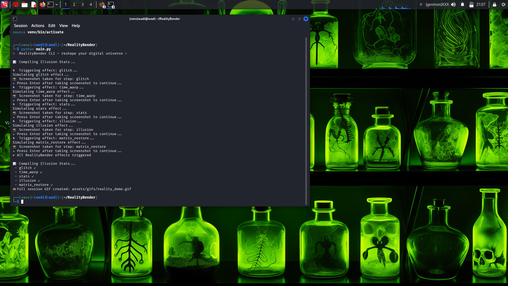
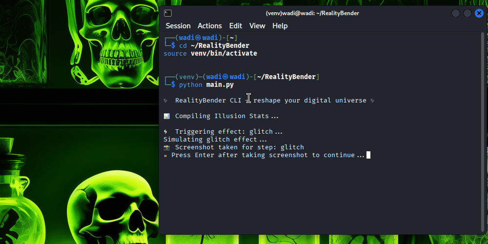

# ✨ RealityBender — Reshape Your Digital Universe ✨

**RealityBender** is a Python CLI tool that simulates visual effects like glitches, time warps, illusions, and matrix restoration.  
It automatically captures screenshots and generates a GIF proof of each session so you can showcase your digital illusions in style.

---

## 🚀 Features

- **Trigger multiple effects in sequence:**
  - Glitch
  - Time Warp
  - Stats
  - Illusion
  - Matrix Restore
- **Automatically capture screenshots** for each effect
- **Generate a session GIF** at the end
- **Clean CLI with rich output**

---

## 📦 Installation

Clone the repo and set up the environment:

\`\`\`bash
git clone https://github.com/howard-dominic/RealityBender.git
cd RealityBender
python3 -m venv venv
source venv/bin/activate
pip install -r requirements.txt
pip install .
\`\`\`

---

## ▶️ Usage

Run the CLI:

\`\`\`bash
python main.py
\`\`\`

or after installing:

\`\`\`bash
realitybender
\`\`\`

---

## 📸 **Proof of Work (Screenshots & GIF)**

> *Keep your files in \`assets/proofs/\` folder. Paths below must remain as-is for GitHub rendering.*

### 🔹 **Glitch Effect**

### 🔹 **Time Warp Effect**

### 🔹 **Stats Effect**

### 🔹 **Illusion Effect**

### 🔹 **Matrix Restore Effect**

### 🔹 **Final Wrap-up**

---

## 🎞️ **Full Session GIF**

> 🔎 *Each frame highlights one effect — perfect for demos and documentation.*

---

## 🗂️ Project Structure

\`\`\`
RealityBender/
├── RealityBender/
│   ├── core/
│   │   └── engine.py
│   └── __init__.py
├── assets/
│   └── proofs/   # contains screenshots & GIF proofs
├── main.py
├── setup.py
├── README.md
├── requirements.txt
└── .gitignore
\`\`\`

---

## 🤝 Contributing

Contributions are welcome!  

1. Fork the repo  
2. Create a new branch (\`git checkout -b feature/your-feature\`)  
3. Commit your changes (\`git commit -m "Add new feature"\`)  
4. Push to your branch (\`git push origin feature/your-feature\`)  
5. Open a Pull Request  

---

## 📜 License

This project is licensed under the **MIT License** — feel free to use, modify, and distribute.
